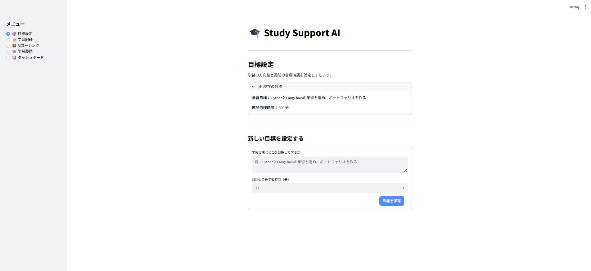
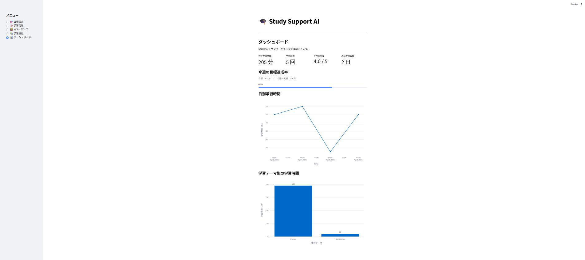
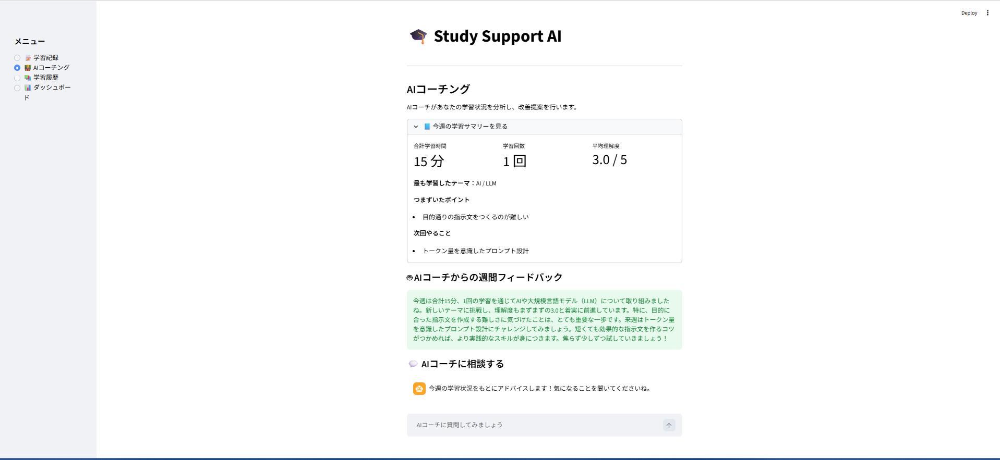

# Study Support AI

学習記録 × 可視化 × AIコーチングで学習を継続させるアプリ

プログラミング学習者向けの学習支援アプリです。
学習記録の保存・可視化・AIコーチングを通じて、継続的な学習をサポートします。

デモはこちらから試せます → https://study-support-ai-fne7fdbozv7rrosfcev7cc.streamlit.app/

| | |
|---|---|
| ユーザー名 | `demo` |
| パスワード | `study2026` |

---

## アプリ画面

### 目標設定


### ダッシュボード


### AIコーチング



## アプリ概要

* 学習内容を記録（日時・テーマ・理解度など）
* 学習データをダッシュボードで可視化
* AIが週間フィードバックを生成
* AIコーチとチャットで相談できる

**学習記録 × 可視化 × AIコーチング** を組み合わせたアプリです

---

## 主な機能

### 目標設定

* 学習目標（どこを目指して学ぶか）をテキストで設定
* 週間の目標学習時間を設定
* 設定した目標をAIコーチングに反映

---

### 学習記録

* 学習日・テーマ・学習時間を入力
* 理解度・つまずいたポイント・次回やることを記録

---

### ダッシュボード

* 合計学習時間・学習回数・平均理解度・連続学習日数
* 今週の目標達成率（進捗バー）
* 日別学習時間の折れ線グラフ
* 学習テーマ別の学習時間（棒グラフ）

---

### 学習履歴

* 過去の学習記録を一覧表示
* 日本語ラベルで見やすく整理
* 絞り込みフィルタ機能
  * 表示期間（開始〜終了日）
  * 学習テーマ
  * 学習時間（○分以上）
* フィルタ後のデータをCSVでダウンロード

---

### AIコーチング

* 設定した目標をもとにAIがパーソナライズされたフィードバックを生成
* つまずいたポイント・次回やることをLLMがカテゴリ別にサマリー化
* チャット形式でAIコーチに質問可能

例：

* 「今週は何を優先して復習すべき？」
* 「目標に向けて今の進捗はどう？」

---

## 技術スタック

* Python 3.11
* Streamlit
* SQLite
* pandas
* Plotly
* OpenAI API
* LangChain
* python-dotenv

---

## アーキテクチャ

```
main.py        ：アプリのエントリーポイント
components.py  ：UI表示ロジック
database.py    ：DB操作
constants.py   ：定数管理
utils.py       ：AI処理（LangChain）
```

UI / DB / AI を分離した構成にしています

---

## AI機能について

### 使用技術

* OpenAI API
* LangChain（PromptTemplate + ChatOpenAI）

### 工夫した点

* 学習記録データと目標をプロンプトに組み込み、個別の状況に応じたフィードバックを生成
* つまずき・次回やることはLLMがカテゴリ別にサマリー化し、自然な文章で表示
* LLMの出力をJSON形式で固定し、パース失敗時のフォールバック処理を実装
* AIコーチとして自然な対話体験を実現

---

## v2 で改善した点

### 1. 目標設定機能の追加

学習目標（テキスト）と週間目標時間を設定できるページを新設しました。
設定した目標はAIコーチングのプロンプトに反映され、目標に沿った具体的なアドバイスが得られます。

### 2. ダッシュボード強化

| 追加要素 | 内容 |
|---|---|
| 連続学習日数 | 今日を起点に何日連続で学習したかを表示 |
| 目標達成率 | 今週の学習時間と目標時間を進捗バーで可視化 |
| 日別折れ線グラフ | 学習時間の推移を時系列で確認できる |

### 3. 学習履歴フィルタ機能の追加

v1 では過去の学習記録を一覧表示するだけでしたが、記録が増えるほど目的の記録を探しにくくなるという課題がありました。

v2 では3つの絞り込み条件を追加し、必要な記録をすぐに確認できるようにしました。

| フィルタ | 内容 |
|---|---|
| 表示期間 | 開始日〜終了日を指定して絞り込み |
| 学習テーマ | 登録済みのカテゴリから選択して絞り込み |
| 学習時間 | 指定した分数以上の記録のみ表示 |

**実装の工夫**

* `st.date_input` の戻り値が操作途中に `(date,)` のような長さ1のタプルになるケースを考慮し、正規化処理を追加
* pandas の `mask` を使って複数条件を `&` で連結し、フィルタ処理を1ブロックにまとめて可読性を確保

### 4. CSVエクスポート

フィルタ後のデータをCSVでダウンロードできるボタンを追加しました。
`encoding="utf-8-sig"` を指定し、Excelで開いても日本語が文字化けしないようにしています。

### 5. AIコーチングのサマリー生成

つまずいたポイントと次回やることを、学習テーマごとにLLMがサマリー化して表示します。
LLMの出力はJSON形式で固定し、パース失敗時は生テキストにフォールバックする設計にしています。

### 6. DBロジックのテスト自動化（pytest）

v2 では、DBの操作を安心して改修できる環境を整えるため、pytest によるテストを追加しました。

`tests/conftest.py` でインメモリSQLiteを使ったテスト用フィクスチャを定義し、  
`tests/test_database.py` に保存・取得・集計・フィルタなど15件のテストを実装。すべてパスしたことを確認しています。

**実装の工夫**

* テストDBを本番DBと完全に分離するため、インメモリSQLiteをフィクスチャで定義
* `database.py` の関数に接続先を渡せる設計にし、テスト時は本番DBに一切触れない構成にした

### 7. Claude Code hooks による自動テスト実行

Claude Code が `Write` / `Edit` でファイルを保存した直後に `tests/test_database.py` を自動実行する PostToolUse フックを設定しています。  
対象は `.py` ファイルのみ。Cursor と役割を分担しながら、ログベースで仮説→検証を繰り返して動作を安定させました。

| ファイル | 役割 |
|---|---|
| `.claude/settings.local.json` | PostToolUse のマッチャーと起動コマンド |
| `.claude/hooks/run-hook.cmd` | `run-tests.ps1` を `-File` で起動するラッパー |
| `.claude/hooks/run-tests.ps1` | `.py` なら venv で pytest → `hook.log` に追記 |

<details>
<summary>実装の工夫・詰まった点（詳細）</summary>

フックは「設定 JSON」「PowerShell」「Claude 側の stdin 渡し」が噛み合わないと黙って動かないことがあり、ログも取れないと原因が見えません。Cursor をメインの作業場所にして、次のループで詰めました。

1. ログを正とする — `.claude/hooks/hook.log` を Cursor で開き、末尾のタイムスタンプが増えるかを確認。動かない段階ではアプリ本体ではなくフック〜スクリプトの経路に問題があると切り分け。

2. Cursor の AI に状況整理を依頼 — ログに出た `JSON parse failed` や `skip:` を貼り、stdin の読み方・JSON の形・マッチャーのどこを疑うべきかを整理。案を自分で読み、必要なら縮小して反映。

3. 差分と再実行で検証 — 修正後は Claude Code で `.py` を再編集させ、`hook started` → `file changed` → `tests passed` の成功パスになるまで繰り返し。

4. 見えてきた落とし穴
   * `Write` と `Edit` は別ブロックで登録しないと `Edit` が拾われない環境がある
   * 長い `powershell -Command` は `$変数` が壊れることがあるため、`run-hook.cmd` から `-File` 起動に寄せた
   * ログは UTF-8（BOM なし）追記に統一（混在で NUL が入りエディタが開けなくなる）
   * ログパスは `$PSScriptRoot\hook.log` に固定（パス誤結合でプロジェクト直下に変な名前の `.log` ができる問題を防止）

このプロセスを通じて「Claude Code がフックを発火」「Cursor でログとコードを突き合わせて直す」役割分担が確立し、自分の判断で仮説→検証を回せるようになりました。

</details>

---

## 開発環境・ツール

### 開発環境

* Python 3.11（仮想環境 venv）
* Windows 11
* Git / GitHub（`main` ブランチ、`v1.0` タグで v1 を保存）

### v1 と v2 の開発スタイルの違い

| バージョン | 開発スタイル |
|---|---|
| **v1**（`v1.0` タグ） | AIツールを使わず自力で実装。アプリの基本構成・DB設計・AI連携をゼロから構築 |
| **v2**（`main` ブランチ） | Claude Code と Cursor を活用し、設計・実装・レビューを効率化 |

v1 でアプリの土台を自分で作り切ったうえで、v2 ではAIツールを使って改善のスピードと品質を上げる、という流れで開発しています。

### v2 で使用した AI 開発ツール

| | Cursor | Claude Code |
|---|---|---|
| ざっくり | AI 付きのコードエディタ（チャット・Agent・ターミナルなど） | 会話とプロンプト形式で指示し、リポジトリを編集するコーディングエージェント |
| v2 での使い方 | コード編集・差分確認・ローカル起動・動作確認、hooks 調整時は `hook.log` とスクリプトを見ながら検証 | 改善方針・タスク分解、複数ファイルにまたがる改修、`.claude` 配下（hooks / skills）のメンテナンス、テスト自動化まわりの切り分け |
| PostToolUse フック | Cursor 上での保存だけでは自動 pytest は走らない | `Write` / `Edit` で保存した直後に `run-tests.ps1` が走る |

併用のイメージ

* Claude Code … 「何を・どの順でやるか」の整理、Claude 経由の編集（このとき hooks 経由で pytest）
* Cursor … 日々の編集・デバッグ、UI の細かい調整、ログとコードを突き合わせた検証

どちらの AI と話しているかは、Claude Code のチャットか Cursor のチャットかで区別すると分かりやすいです。各ファイルの役割（UI / DB / AI）は崩さないよう意識しています。

---

## セットアップ方法

### 1. リポジトリをクローン

```bash
git clone <リポジトリURL>
cd study-support-ai
```

---

### 2. 仮想環境を作成・有効化

```bash
python -m venv venv

# Windows
venv\Scripts\activate

# Mac / Linux
source venv/bin/activate
```

---

### 3. 必要パッケージをインストール

```bash
pip install -r requirements.txt
```

---

### 4. `.env` ファイルを作成

プロジェクト直下に `.env` を置き、OpenAI の API キーを設定します（**Git にはコミットしない**。`.gitignore` に含まれています）。

```env
OPENAI_API_KEY=your_api_key
```

`utils.py` が `python-dotenv` で読み込み、AI コーチング機能で使用します。

---

### 5. アプリ起動

```bash
streamlit run main.py
```

---

## 必要パッケージ

```
streamlit
pandas
plotly
openai
langchain
langchain-openai
python-dotenv
```

---

## 今後の改善案

* 週間レポートのグラフ化
* ユーザー認証

---

## 制作意図

学習を「記録するだけ」で終わらせず、
**目標設定 → 記録 → 振り返り → 次の行動** までサポートすることを目的に開発しました。

特にAIコーチング機能では、単なる要約ではなく「設定した目標に向けて次にどう行動するか」にフォーカスしています。

---

## ポイント

* データの蓄積（SQLite）
* 可視化（Plotly）
* AI活用（LangChain + OpenAI）
* UI / ロジック分離設計（main / components / database / utils）
* テスト自動化（pytest と Claude Code hooks）
* **Claude Code でフックを発火させ、Cursor で `hook.log`・差分・ローカル実行を見ながら改善を回した**開発プロセス

実務を意識した構成（UI / DB / AI の分離）と、ツールの役割を切り分けた検証の仕方を意識しています。
